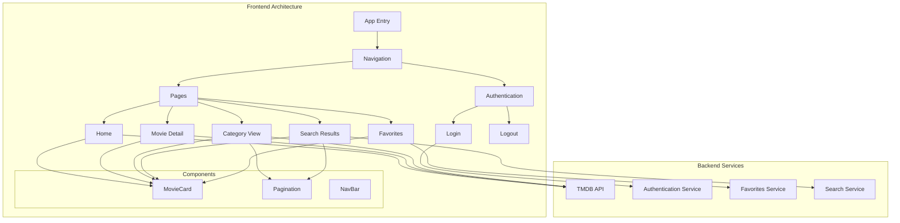

# 🎬 MovieHub

> A modern React-based platform for movie enthusiasts to discover, search, and rate films.

[](https://choosealicense.com/licenses/mit/)
[](https://reactjs.org/)
[](https://tailwindcss.com/)
[](https://www.themoviedb.org/documentation/api)
[](https://tanstack.com/query)
[](https://www.radix-ui.com/)

## 📋 Overview

MovieMate is a responsive web application built with React that provides a seamless experience for movie enthusiasts. Powered by The Movie Database (TMDB) API, users can discover top-rated, popular, and upcoming films, search for specific titles, view detailed information, rate movies, and save favorites. With its modern UI and smooth user experience, MovieMate is the perfect companion for your movie exploration journey.

## ✨ Features

- **Movie Discovery**: Browse through top-rated, popular, and upcoming movies
- **Search Functionality**: Find specific movies with real-time search results
- **Movie Details**: Access comprehensive information including cast, ratings, and reviews
- **User Authentication**: Secure login with TMDB credentials 
- **Personal Ratings**: Rate movies on a 5-star scale
- **Favorites System**: Save movies to your favorites list for easy access
- **Responsive Design**: Enjoy a seamless experience across desktop and mobile devices
- **Recommendations**: Get movie suggestions based on your viewing history
- **User Reviews**: Read what others think about a movie
- **Pagination**: Easily navigate through large collections of movies

## 🖼️ Screenshots & Demo


## 🔍 Application Structure



## 🛠️ Technologies Used

<table>
  <thead>
    <tr>
      <th>Category</th>
      <th>Technologies</th>
      <th>Purpose</th>
    </tr>
  </thead>
  <tbody>
    <tr>
      <td>Frontend Framework</td>
      <td>React, React Router</td>
      <td>Building the user interface and handling navigation</td>
    </tr>
    <tr>
      <td>State Management</td>
      <td>React Query</td>
      <td>Managing server state and caching API responses</td>
    </tr>
    <tr>
      <td>UI Components</td>
      <td>Radix UI, Lucide React</td>
      <td>Accessible UI components and icons</td>
    </tr>
    <tr>
      <td>Styling</td>
      <td>Tailwind CSS</td>
      <td>Utility-first CSS framework for styling</td>
    </tr>
    <tr>
      <td>Animation</td>
      <td>Framer Motion</td>
      <td>Creating smooth animations and transitions</td>
    </tr>
    <tr>
      <td>API Integration</td>
      <td>TMDB API</td>
      <td>Fetching movie data, user authentication, and ratings</td>
    </tr>
  </tbody>
</table>

## 🔐 Authentication Flow

<svg viewbox="0 0 800 400">
  <!-- Background -->
  <rect width="800" height="400" fill="#f8fafc" rx="10" ry="10" />
  
  <!-- Boxes -->
  <rect x="50" y="150" width="150" height="100" rx="10" ry="10" fill="#0f172a" stroke="#334155" stroke-width="2" />
  <rect x="325" y="150" width="150" height="100" rx="10" ry="10" fill="#0f172a" stroke="#334155" stroke-width="2" />
  <rect x="600" y="150" width="150" height="100" rx="10" ry="10" fill="#0f172a" stroke="#334155" stroke-width="2" />
  
  <!-- Labels -->
  <text x="125" y="200" fill="white" font-family="Arial" font-size="16" text-anchor="middle">Client App</text>
  <text x="400" y="200" fill="white" font-family="Arial" font-size="16" text-anchor="middle">TMDB Auth API</text>
  <text x="675" y="200" fill="white" font-family="Arial" font-size="16" text-anchor="middle">User Session</text>
  
  <!-- Arrows -->
  <path d="M200 180 L325 180" stroke="#6366f1" stroke-width="2" marker-end="url(#arrowhead)" />
  <path d="M475 180 L600 180" stroke="#6366f1" stroke-width="2" marker-end="url(#arrowhead)" />
  <path d="M600 220 L475 220" stroke="#6366f1" stroke-width="2" marker-end="url(#arrowhead)" />
  <path d="M325 220 L200 220" stroke="#6366f1" stroke-width="2" marker-end="url(#arrowhead)" />
  
  <!-- Arrow labels -->
  <text x="262" y="170" fill="#475569" font-family="Arial" font-size="12" text-anchor="middle">1. Request Token</text>
  <text x="537" y="170" fill="#475569" font-family="Arial" font-size="12" text-anchor="middle">2. Validate Login</text>
  <text x="537" y="240" fill="#475569" font-family="Arial" font-size="12" text-anchor="middle">3. Create Session</text>
  <text x="262" y="240" fill="#475569" font-family="Arial" font-size="12" text-anchor="middle">4. Store Session ID</text>
  
  <!-- Title -->
  <text x="400" y="60" fill="#0f172a" font-family="Arial" font-size="24" font-weight="bold" text-anchor="middle">MovieMate Authentication Flow</text>
  <text x="400" y="90" fill="#64748b" font-family="Arial" font-size="14" text-anchor="middle">Secure login process using TMDB Authentication API</text>
  
  <!-- Arrow definition -->
  <defs>
    <marker id="arrowhead" markerWidth="10" markerHeight="7" refX="10" refY="3.5" orient="auto">
      <polygon points="0 0, 10 3.5, 0 7" fill="#6366f1" />
    </marker>
  </defs>
</svg>

## 🗂️ Project Structure

```
src/
├── components/          # Reusable UI components
│   ├── Footer.jsx       # Footer component
│   ├── MovieCard.jsx    # Card display for movies
│   ├── NavBar.jsx       # Navigation component
│   └── Pagination.jsx   # Pagination controls
├── Pages/               # Page components
│   ├── Home.jsx         # Home page with movie categories
│   ├── Category.jsx     # Category-specific movie listings
│   ├── MovieDetail.jsx  # Detailed view of a movie
│   ├── Favourite.jsx    # User's favorite movies
│   └── useFavorite.jsx  # Custom hook for favorites functionality
├── auth/                # Authentication related components
│   ├── auth.jsx         # Main authentication component
│   ├── LogoutButton.jsx # Logout functionality
│   └── mutation.jsx     # Auth-related API mutations
├── services/            # API service functions
├── App.jsx              # Main application component with routing
└── main.jsx             # Application entry point
```

## 🚀 Installation & Setup

1. **Clone the repository:**
   ```bash
   git clone https://github.com/yourusername/MovieRatinGApp.git
   cd MovieRatinGApp
   ```

2. **Install dependencies:**
   ```bash
   npm install
   ```

3. **Create a `.env` file in the root directory and add your TMDB API key:**
   ```
   VITE_TMDB_API_KEY=your_api_key_here
   ```

4. **Start the development server:**
   ```bash
   npm run dev
   ```

5. **Open your browser and navigate to:**
   ```
   http://localhost:5173
   ```

## 🎬 Key Components

### MovieCard Component

The `MovieCard` component is a core UI element that displays movie information in an attractive and interactive card format.

```jsx
<MovieCard 
  movie={{
    id: 123,
    title: "Movie Title",
    poster_path: "/path/to/poster.jpg",
    vote_average: 8.5,
    release_date: "2023-05-12"
  }} 
/>
```

### Authentication System

MovieMate uses TMDB's authentication system to allow users to rate movies and save favorites:

```jsx
// Login process
const { mutate } = useMutation({
  mutationKey: ['Login'],
  mutationFn: MutateUserLogin,
  onSuccess: (data) => {
    localStorage.setItem('tmdb_session_id', data.session_id)
    navigate('/')
  }
})
```

## 🔄 API Integration

MovieMate integrates with The Movie Database (TMDB) API to fetch movie data. Here are the key endpoints used:

- **Popular movies**: `/movie/popular`
- **Top-rated movies**: `/movie/top_rated`
- **Upcoming movies**: `/movie/upcoming`
- **Movie details**: `/movie/{movie_id}`
- **Movie credits**: `/movie/{movie_id}/credits`
- **Movie recommendations**: `/movie/{movie_id}/recommendations`
- **Movie reviews**: `/movie/{movie_id}/reviews`
- **Search functionality**: `/search/movie`

## 🌟 Features in Detail

### Home Page
- Horizontal scrolling carousels for different movie categories
- Quick access to top-rated, popular, and upcoming movies
- Search functionality with real-time results

### Movie Details
- Comprehensive movie information (release date, runtime, rating)
- Cast information with photos and character names
- User reviews with expandable content
- Similar movie recommendations
- Personal rating system
- Add to favorites functionality

### Categories
- Dedicated pages for top-rated, popular, and upcoming movies
- Pagination for browsing through large collections
- Loading states and error handling

### Favorites
- Persistent storage of favorite movies using localStorage
- Quick access to saved movies
- Seamless addition and removal from favorites

## 🔮 Future Enhancements

- [ ] User authentication with personal profiles
- [ ] Watchlist functionality
- [ ] Custom user reviews
- [ ] Advanced filtering options
- [ ] Movie trailers integration
- [ ] Dark/Light theme toggle
- [ ] TV Shows section with similar functionality to Movies

## 📄 License

This project is licensed under the MIT License - see the LICENSE file for details.

## Acknowledgements

- The Movie Database (TMDB) for providing the API
- React and its community 
- Tailwind CSS for the utility-first CSS framework
- Framer Motion for smooth animations
- React Router for navigation
- React Query for data fetching
- Radix UI for accessible components

---

Made with ❤️ by Vedang

⭐ Please consider giving this repo a star if you find it useful!
```
